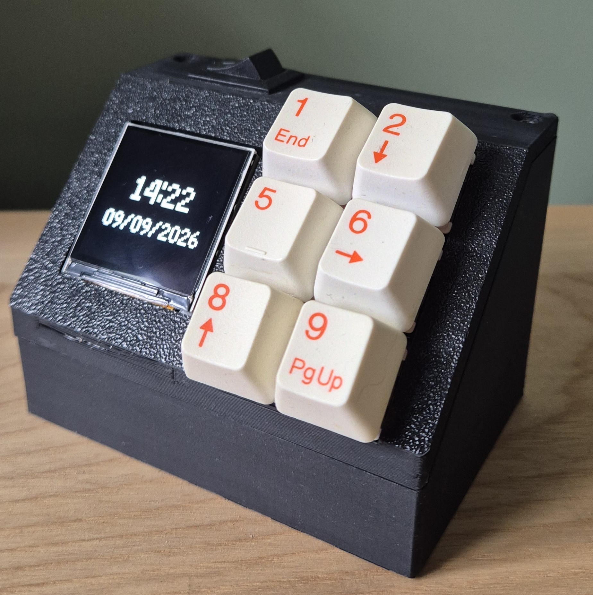
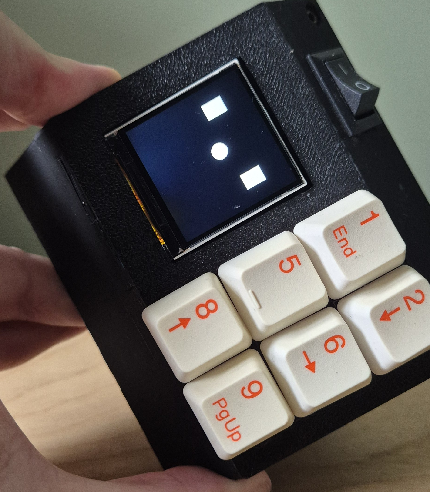
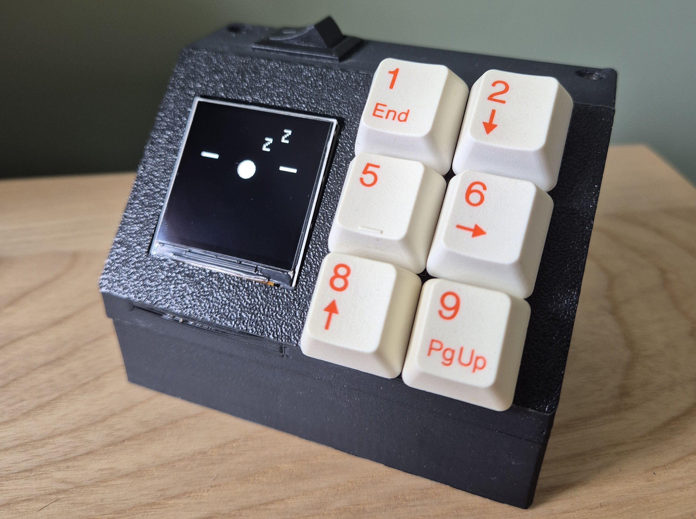
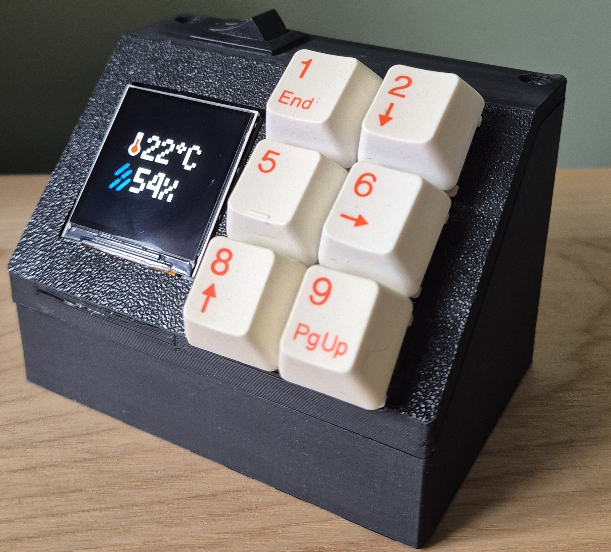
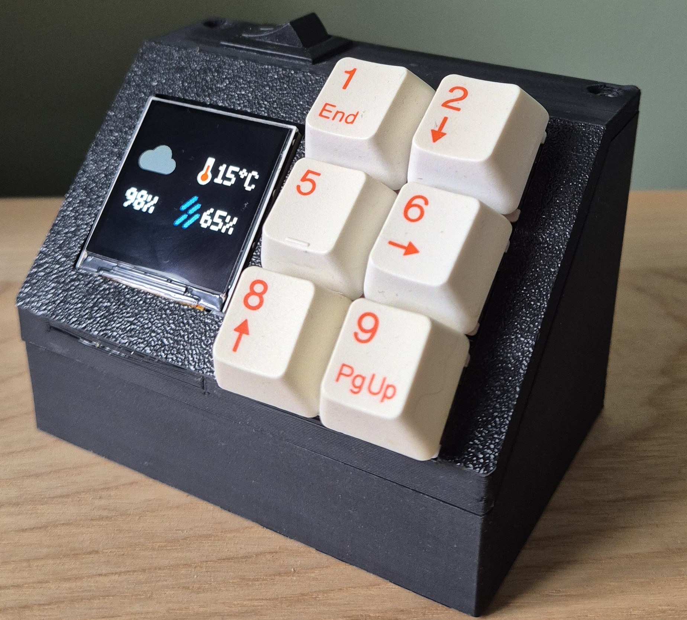

I made a Raspberry Pi Pico powered clock!

The inspiration for this project came from having smart switches that control my computer, screens and 3D printers. I found it easier to turn them on via a device that was located at my desk instead of having to open an app on my phone. Having made a device that does this I found it to be  a bit featureless and thought I could make it into something a bit more useful.

You can find all the code and files for this project below


## PCB Design

I came to the conclusion that a smart(ish) clock would be a good idea and I could integrate other features with it. So I began designing my own PCB that could house a Raspberry Pi Pico microcontroller. I knew I wanted to include some sensors alongside it that could report things like ambient temperature. I also wanted these to be interchangeable so that I could swap them or if others wanted different modules they could. Luckily these modules already exist and I took inspiration from the [Pimoroni breakout board](https://shop.pimoroni.com/products/pico-breakout-garden-base?variant=32369509892179)

With this in mind I set about making a PCB design to house a Raspberry Pi Pico, sensor modules, screen and buttons. I came up with a two board design, one that houses the Pico and sensors and the other that houses the screen and buttons. These will be connected together via wires and JST connectors, this way I can angle the screen and buttons so they are easier to view and use.


  
  
  
  


## Case Design

Now that I had the PCBs I could start work on 3D modeling a case for the clock. The case is pretty basic and something that if I was to revisit this I would redesign a better case now that my 3D modeling skills are better.

It houses both boards and allows you to plug in the USB cable into the pico from the back. I also added some ventilation holes so that the Pico wouldn't overheat and so that the sensors could get a more accurate reading of the ambient temperature.

The case is split into two parts, one that houses both PCBs and one that covers the upper PCB so there is a nice unified surface. The upper case part also is where I mounted a switch to turn off/on the screen, as this was located in my room I thought that being able to turn off the display would be a good option. With it being 3D printed I made use of heat insets so that screws could be used to hold all these parts together.

## Code

I opted for running [Pimoroni's Pico Firmware](https://github.com/pimoroni/pimoroni-pico) with MicroPython as I have used it before and found it to work well. It also comes with all the modules for the Pimoroni hardware that I'm using such as the screen and sensor modules.

### Emotions

I set out creating the basic functions for the desk clock and I ended up not starting with the time weirdly. I started making some emotions so that the clock had a bit of personality, these include neutral, happy, shocked, blinking etc. All of these however did not end up being used but they're there if I ever decide to add more to this project. I also set up the MSA301 module which can detect movement so if i were to pick up the clock it would know. I made it so if that happened the clock would show a shocked face.

I had the idea that if left for a few minutes the face would start sleeping. In the code this works by running a timer and when it's been idle for 5 minutes it plays an animation. It can then be woken up by holding a button.

### Smart Switch Buttons

Next up was the smart switch buttons, I basically wanted to press a button on the clock and it toggle one of my smart switches. For this is made use of the simple MQTT client for MicroPython from the [micropython-lib repository](https://github.com/micropython/micropython-lib/) I can then input my MQTT server details into my secret file and send whatever MQTT command I want, in this case to toggle a switch.

### Time/Date

Time! Probably the thing I should have started with first considering this is the main feature of a clock... Anyway, making use of the RTC module I set the time and pull directly from this module and display it nicely on the display. The time currently does not account for daylight saving time which is something that I'd like to add in the future. Currently this has to be manually adjusted in the code.

### Ambient Temperature

Making use of the BME280 module and its built in temperature and humidity sensors I pulled the values and made a nice dashboard for them.

### Weather

For the weather I made use of [OpenWeatherMaps](https://openweathermap.org/) API. Within the secret file you can add your API key, location and units. The Pico will pull this data and based on if it rainy/cloudy/sunny even snowing the graphic will update. This is all displayed in a simple weather dashboard.

### Navigating The Clock

The clock has 6 buttons in total the top two are for going back or forwards between the different dashboards, the remaining 4 are for smart switches.

The different dashboards are:

1. Emotions - Neutral, shocked or sleeping faces
2. Time/Date
3. Ambient temperature
4. Weather data pulled from OpenWeatherMaps

## Wrap up

This was a really fun project and one that I learned a lot from. Having the different aspects of designing a PCB and case from scratch was a really good learning experience. I got a lot more exposure to Python and had a really fun time bringing all the features together.

### Improvements

As with every project there are a few things I think I could improve on if I was to revisit this. The case design could be improved as it's pretty basic and has some flaws. More features could be added. I did play around with a network dashboard where it could ping various devices and see if they are up or down but it seemed too resource intensive and made the whole dashboard pretty slow so it was removed but the code still exists so maybe it's something I could revisit.

### The Next Version

I would like to redo this whole project with something a bit more powerful such as a Raspberry Pi and make a board with all the sensors soldered directly to it, I think this would further my PCB designing skills. It could include more hardware such as speakers/microphone and a touch screen. AI integration would also be a cool feature!
