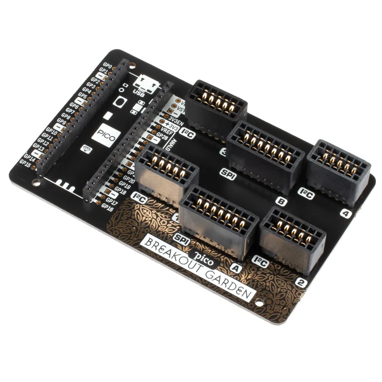
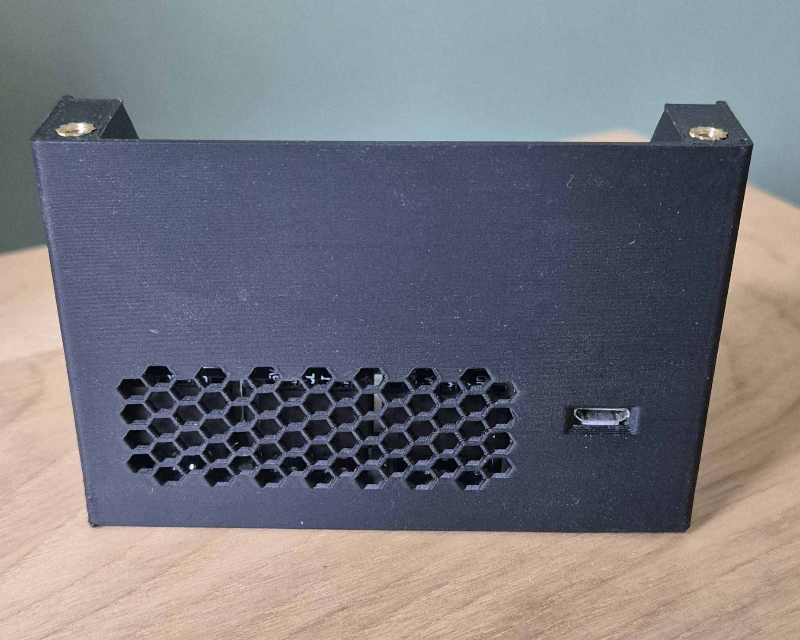

I made a Raspberry Pi Pico powered clock!

The inspiration for this project came from having smart switches that control my computer, screens and 3D printers. I found it easier to turn them on via a device that was located at my desk instead of having to open an app on my phone. Having made a device that does this I found it to be  a bit featureless and thought I could make it into something a bit more useful. 

## PCB Design

I came to the conculsion that a smart(ish) clock would be a good idea and I could intergrate other features with it. So I began designing my own PCB that could house a Raspberry Pi Pico microcontroller. I knew I wanted to include some sensors along side it that could report things like ambient temperature, I also wanted these to be interchangable so that I could swap them or if others wanted different modules they can. Luckily these modules already exist and I took inspiration from the [Pimoroni breakout board](https://shop.pimoroni.com/products/pico-breakout-garden-base?variant=32369509892179) 

With this in mind I set about making a PCB design to house a Raspberry Pi Pico, sensor modules, screen and buttons. I came up with a two board design one that houses the Pico and sensors and the other that houses the screen and buttons. These will be connected together via wires and JST connectors, this way I can angle the screen and buttons so they are easier to view and use. 


  
  
  
  


## Case Design

Now I had the PCBs I could start work on 3D modeling a case for the clock. The case is pretty basic and something that if I was to revisit this I would redesign a better case now that my 3D modeling skills are better. 

It houses both boards and allows you to plug in the USB cable into the pico from the back, I also added some ventilation holes so that the Pico wouldnt overheat and so that the sensors could get a more accurate reading of the ambient temperature. 

The case is split into two parts one that houses both PCBs and one that covers the upper PCB so there is a nice unified surface. The upper case part also is where I mounted a switch to turn off/on the screen, as this was located in my room I thought that being able to turn off the display would be a good option. With it being 3D printed I made use of heat insets so that screws could be used to hold all these parts together.

